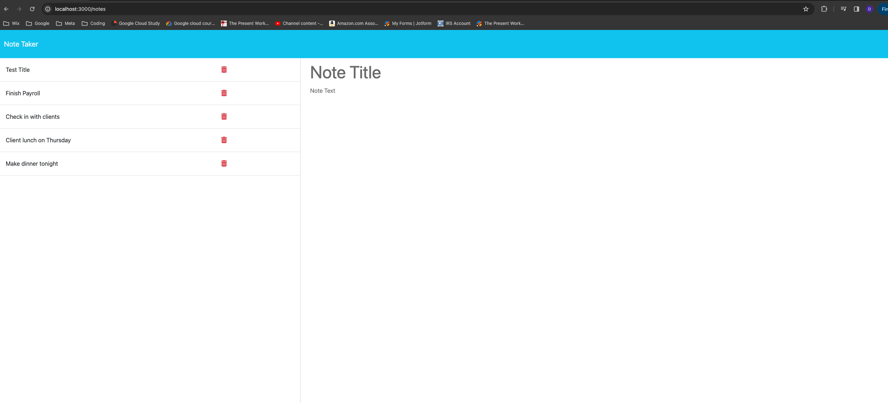

# Express Notes

[](https://opensource.org/licenses/MIT)
<a name="readme-top"></a>


<!-- PROJECT LOGO -->
<br />
<div align="center">

  <p align="center">
    This project allows the user to quickly write notes on demand.
    <br />
    <a href="https://github.com/ddprzy37/Express-Notes/"><strong>Explore the docs »</strong></a>
    <br />
    <br />
    <a href="https://drive.google.com/file/d/1apMPfvmjZTaCjddHRlxhanKxgTj6Xy6z/view">View Demo</a>
    ·
    <a href="https://github.com/ddprzy37/Express-Notes/issues/new?labels=bug&template=bug-report---.md">Report Bug</a>
    ·
    <a href="https://github.com/ddprzy37/Express-Notes/issues/new?labels=enhancement&template=feature-request---.md">Request Feature</a>
  </p>
</div>

## Description

This project allows the user to quickly write notes on demand.

- Motivation: Motivation was to allow a user to keep track of their notes quickly and easily.
- Problems: I faced problems with getting my routes correctly lined up so they would run properly.
- Solve: Is a good app to write down notes on a phone as compared to a notepad.
- Learn: I learned how to use express better.
- Stand Out: This project stands out because of its simplicity and ease of use.

[](https://example.com)


<p align="right">(<a href="#readme-top">back to top</a>)</p>

Here's a blank template to get started: To avoid retyping too much info. Do a search and replace with your text editor for the following:


## Getting Started

Please see the demo link up at the top for a visual demonstration on how to use this app.

## Installation

1. Clone the repo
   ```sh
   git clone https://github.com/ddprzy37/Express-Notes.git
   ```
2. Install NPM packages
   ```sh
   npm install
   ```

<p align="right">(<a href="#readme-top">back to top</a>)</p>

## Roadmap
 * When loading the page click new note
 * Type out new note with whatever you wish to write with a brief description
 * You can either either clear note or save not
 * You can select previously saved notes or delete them when done

See the [open issues](https://github.com/ddprzy37/Express-Notes/issues) for a full list of proposed features (and known issues).

<p align="right">(<a href="#readme-top">back to top</a>)</p>

## License

This project is licensed under the [MIT License]([MIT License](https://opensource.org/licenses/MIT)).


## Contact

Project Link: [https://github.com/ddprzy37/Express-Notes](https://github.com/ddprzy37/Express-Notes)

<p align="right">(<a href="#readme-top">back to top</a>)</p>


